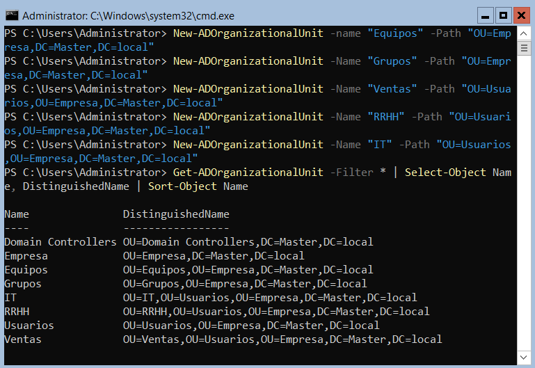
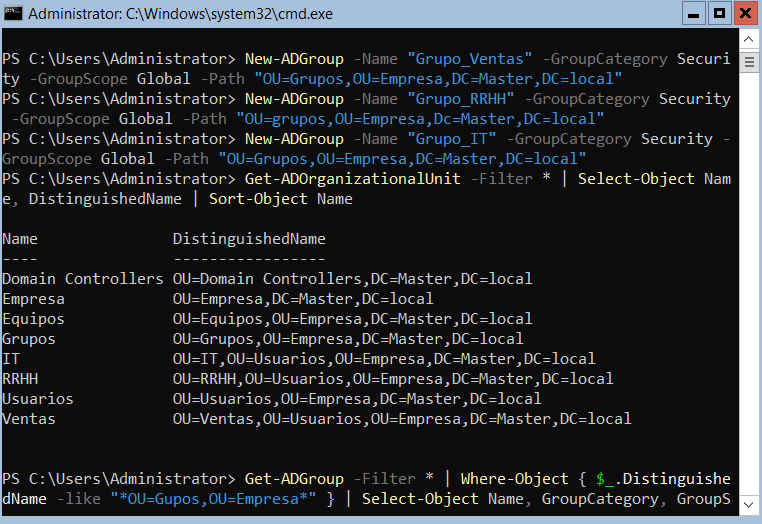
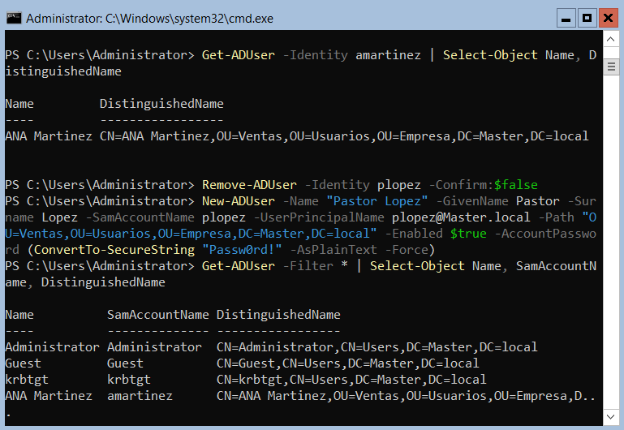
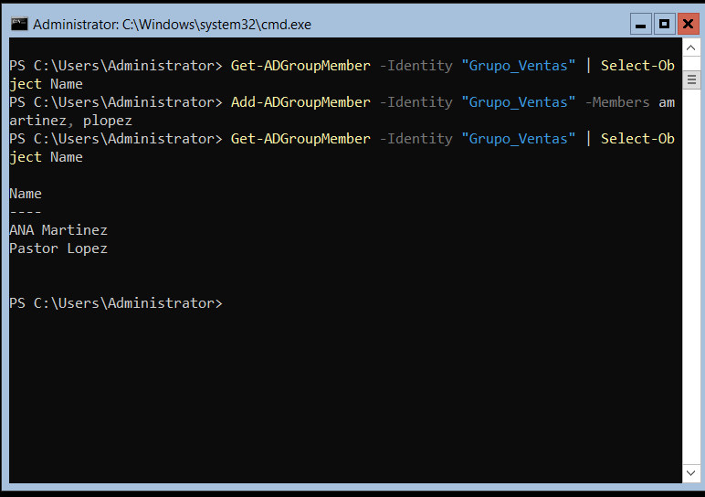
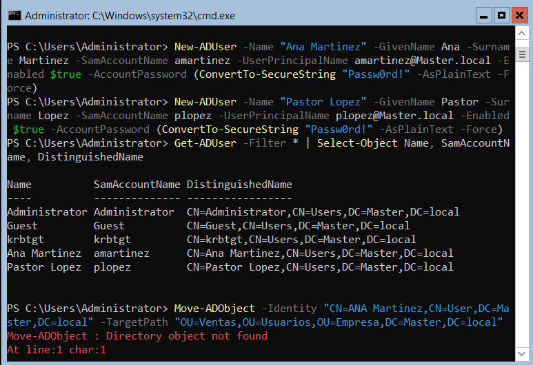
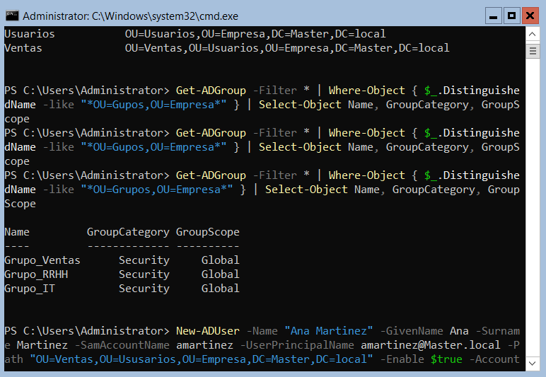
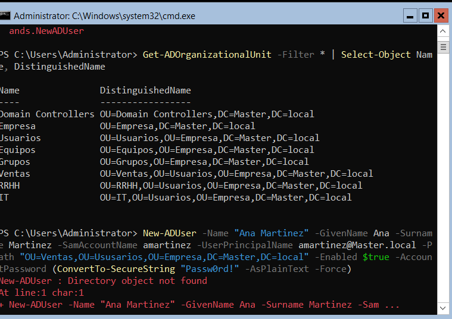

Acknowledgments & Development Process

This project was developed with the assistance of **AI tools (DeepSeek)** to accelerate the learning curve, debug syntax errors, and structure the documentation in a clear, professional format.

Why this matters: In modern IT, leveraging AI as a co-pilot is a key skill. While the AI provided guidance and syntax correction, all commands were executed manually in the live virtual environment, and every error was validated, understood, and resolved hands-on. This documentation reflects a hybrid workflow: human judgment + AI efficiency.

The final structure, security decisions, and troubleshooting steps were reviewed and approved by the author to ensure accuracy and practical relevance.

Windows Server 2022 AD DS Lab

Description
This repository documents the complete setup and administration of an Active Directory Domain Services (AD DS) environment using Windows Server 2022 Evaluation, running as a virtual machine on Oracle VirtualBox. The project was built as part of my preparation for the Microsoft Applied Skills: Administer Active Directory Domain Services (APL-1008) credential.

Objectives
•	Build a functional domain (`Master.local`) from scratch
•	Create a hierarchical OU structure (Empresa → Usuarios/Equipos/Grupos → Ventas/RRHH/IT)
•	Create security groups and user accounts
•	Assign users to groups (simulate real-world permissions)
•	Document both successes and errors to show problem solving skills
•	(Next steps) Automate repetitive tasks with PowerShell scripts

Technologies Used
Technology  |  Version 

Virtualization Oracle VirtualBox 7.x 
Operating System Windows Server 2022 Standard (Evaluation) 
Directory Service Active Directory Domain Services (AD DS) 
Automation PowerShell 5.1
Documentation Markdown, GitHub 

Screenshots

1. OU Structure

2. Security Groups

3. User Creation

4. Group Membership

5. Move Error (Directory object not found)

6. Error Correction (Get-ADGroup syntax)

7. Final OU Structure

What Was Built

1. Domain
Forest/Domain: “Master.local”
Domain Controller: Windows Server 2022

2. Organizational Units (OU)
Empresa
├── Usuarios
│ ├── Ventas
│ ├── RRHH
│ └── IT
├── Equipos
└── Grupos

3. Security Groups
•	Grupo_Ventas (Global, Security)
•	Grupo_RRHH (Global, Security)
•	Grupo_IT (Global, Security)

4. Users
Full Name              SamAccountName                       OU                   Group Membership 
Ana Martinez              “amartinez”                     Ventas                    Grupo_Ventas 
Pastor Lopez                 “plopez”                     Ventas                    Grupo_Ventas 

Errors Encountered & Resolved

This section documents the most significant errors I faced during the lab, along with their causes and solutions. These are not just mistakes – they are learning opportunities that helped me understand how Active Directory works under the hood.

| Error | Cause | Solution |
|Directory object not found (moving user) | Typo: CN=User vs CN=Users+case mismatch (`ANA` vs `Ana`) | Used `Get-ADUser` to fetch the exact DistinguishedName, then copied it into the `Move-ADObject` command. |
|Invalid filter syntax in `Get-ADGroup` | Used -Filter | where-Object incorrectly (pipeline inside the filter parameter). | Used Filter to get all groups, then piped the result to `Where-Object` with the correct syntax. |
|ConvertToSecureString` command not found| Typo: missing the letter "e" in `ConvertTo-SecureString`. | Corrected to `ConvertTo-SecureString`. |

> Note: For a complete list of troubleshooting steps and additional errors, see [`docs/troubleshooting.md`](docs/troubleshooting.md).

Next Steps
This lab is a solid foundation, but there are several areas to expand for deeper learning and real-world readiness. Below is the planned roadmap.

Security Hardening
•	Configure Account Lockout Policy – Set threshold to 5 failed attempts, lockout duration 30 minutes.
•	Review and strengthen Default Domain Password Policy – Increase minimum length, complexity, and expiration.
•	Implement Fine Grained Password Policies (FGPP) – Apply stricter policies for IT and admin accounts.
•	Enable Delegation of Control – Allow HR or department leads to reset passwords within their own OUs.
•	Add privileged accounts to the Protected Users group – Mitigate credential theft attacks.
•	Enable advanced audit policies – Log successful and failed logon events, account changes, and policy modifications.

Advanced Administration
•	Create and link Group Policy Objects (GPOs) – Apply settings like drive mappings, desktop backgrounds, or software restrictions.
•	Enable the Active Directory Recycle Bin – Recover deleted objects without restoring from backup.
•	Deploy a second Domain Controller – Practice replication and high availability.
•	Configure AD Sites and Subnets – Simulate multiple office locations.
•	Join a Windows 10/11 client VM to the domain – Test authentication and Group Policy application from a user’s perspective.

Automation & Scripting
Write PowerShell scripts for
  - Bulk user import from CSV.
  - Mass password resets.
  - Simulated help desk ticket resolution (password resets, unlocks, moves, etc.).
Automate user creation with a CSV template – Practice generating users with realistic attributes.

Exam Preparation (Microsoft APL 1008)
•	Complete the official **Microsoft Learn learning path** for Administer Active Directory Domain Services.
•	Practice with the **Guided Project** – a simulated lab environment that mirrors the exam.
•	Review all tasks: promoting a DC, managing OUs, delegating control, configuring GPOs, and monitoring security logs.

Documentation & Portfolio
•	Publish all scripts and configuration examples to this repository.
•	Add screenshots for new practices (GPOs, delegation, audit logs).
•	Keep the `troubleshooting.md` file updated with new errors and solutions.
•	Share the repository on LinkedIn and include it in my CV.
*This section will be updated as I progress through each task.*

Repository Structure
Windows-Server-ADDS-Lab/
├── README.md
├── images/
│ ├── 01-install-windows.png
│ ├── 02-SConfig.png
│ ├── 03-ADDS-role.png
│ ├── 04-promote-DC.png
│ ├── 05-OUs.png
│ ├── 06-groups.png
│ ├── 07-users.png
│ └── 08-group-membership.png
└── docs/
└── troubleshooting.md
